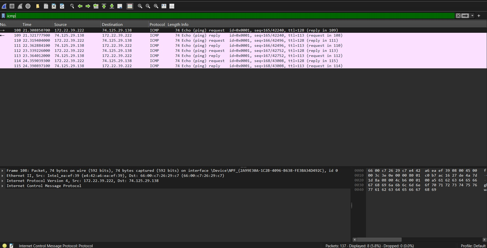
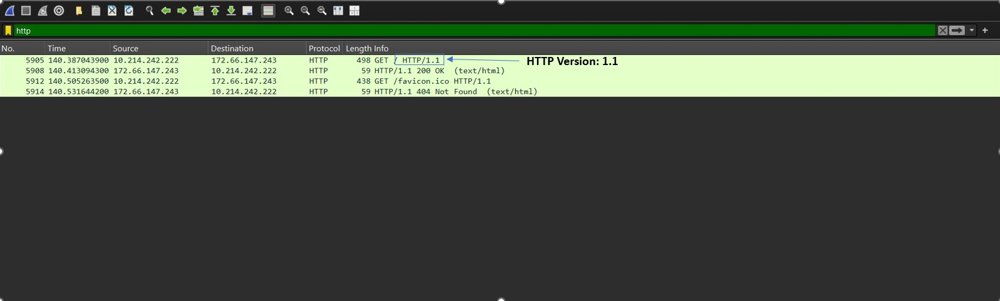

# Advanced Network Architecture & Traffic Inspection Labs

## Overview
This repository contains a comprehensive suite of network protocol analysis, security evaluations, and performance diagnostic investigations conducted using **Wireshark**. The primary focus of these labs was to analyze live packet streams, dissect cryptographic structures, map core networking parameters, and establish defensive signature baselines to detect network anomalies.

## Covered Research & Documentation (PDFs Included)
1. **wireshark.pdf**: Initial environment setup, network interface verification, and live WLAN packet capture baseline.
2. **Network Protocol Analysis and Performance Diagnostic Report.pdf**: Technical investigation into network latency, protocol distribution analysis (TCP, DNS, ARP, HTTP, ICMP), and secure encapsulation analysis.
3. **Practical Network Traffic Analysis Using Wireshark.pdf**: Deep dive into the TCP 3-way handshake sequence, Layer 2 OUI/MAC vendor verification (Intel architecture), and HTTP header inspection.
4. **ICMP Traffic Analysis Using Wireshark.pdf**: Diagnostic threat modeling mapping ICMP behaviors (Type 8 Requests, Type 0 Replies, and TTL Exceeded In-Transit errors via `tracert`) to build proactive signature baselines.

## Key Technical Concepts Demonstrated
* **Deep-Packet Inspection (DPI)**: Filtering and analyzing raw network captures (PCAP data) to isolate traffic flows.
* **Cryptographic Dissection**: Evaluating secure tunnels and encryption layers including WireGuard, TLS 1.3, and QUIC.
* **Defensive Threat Modeling**: Implementing protocol filtering syntax to detect potential anomalies like ICMP Floods and Session Layer reconnaissance.

## Environment & Specifications
* **Operating System**: Windows 10 Pro 64-bit (Version 22H2)
* **Analysis Tool**: Wireshark v4.6.4
* **Testbeds**: University of the People Student Portal & Controlled External Test Environments

---

## Visual Evidence & Packet Captured Analysis
Here is the practical verification of the captured protocols, featuring deep-packet inspections:

### 1. TCP 3-Way Handshake Sequence Analysis
Demonstrating the exact connection establishment phase (SYN -> SYN-ACK -> ACK).

### 2. ICMP Diagnostic Analysis
Verification of Echo Requests and Replies with exact network checksum status checking.

### 3. HTTP Protocol Extraction
Filtering active web queries to identify versioning profiles (HTTP/1.1).

### 4. WireGuard VPN Encapsulation Traffic
Monitoring secure cryptographic tunnels and encrypted transport layers.
